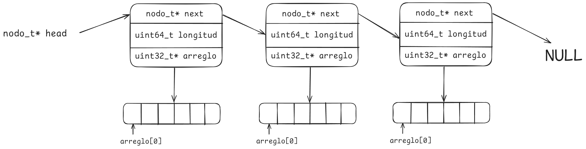

# TP1-a: Programación Orientada a Datos - ANSI C
Arquitectura y Organización del Computador

**Entrega:** 05/09/2024

**Reentrega del TP1 completo (tp1-a, tp1-b y tp1-c):** 03/10/2024

-------------
En este taller vamos a trabajar con código `C` interpretándolo desde la perspectiva de los datos, y en particular, de la forma en que los datos se ubican en memoria.
Implementaremos algunas estructuras de datos que nos ayudarán a entender cómo programar en el lenguaje C y cómo hacer correcto uso de memoria dinámica.

> :pen_fountain: No olviden completar en este archivo las preguntas teóricas que figuren en el enunciado.

Se recomienda **fuertemente** ir haciendo commits de su progreso a medida que avanzan con los puntos del trabajo práctico, para evitar pérdidas de progreso ante cualquier problema técnico que pudiera surgir.

## Tabla de contenidos
- [TP1-a: Programación Orientada a Datos - ANSI C](#tp1-a-programación-orientada-a-datos---ansi-c)
  - [Tabla de contenidos](#tabla-de-contenidos)
  - [Preparación](#preparación)
  - [Introducción](#introducción)
    - [Precalentando](#precalentando)
      - [Compilar y linkear con Makefiles](#compilar-y-linkear-con-makefiles)
      - [Contar Espacios](#contar-espacios)
    - [Complejizando un poco](#complejizando-un-poco)
      - [Lista Enlazada](#lista-enlazada)
      - [Vector](#vector)
    - [Ejercicio Integrador](#ejercicio-integrador)
  - [Entrega](#entrega)

## Preparación
Se asume que completaron el trabajo práctico 0 de la materia, luego del cual deberían tener configurado `git` en su entorno de trabajo local y haber realizado un fork propio del repositorio de trabajos prácticos individuales.

Para el desarrollo de este trabajo práctico se deberá realizar un fork por grupo, en el cual se deberán completar las tres partes del trabajo (tp1-a, tp1-b, tp1-c).
No olviden **agregar a todos los miembros del grupo** a su fork grupal con nivel de acceso `mantainer`, así todos pueden participar del código y realizar consultas mediante issues.

Si en algún momento más de un miembro del grupo quisiera hacer cambios al código del repositorio en simultáneo, es una buena práctica que cada uno cree una nueva `branch` donde alojar los cambios que quieren hacer temporalmente.
Una vez que terminen de realizar sus cambios, pueden abrir un `pull request` a la branch principal (usualmente llamada `main` o `master`) **de su fork** e incorporar los nuevos cambios al cuerpo de la resolución de manera ordenada. Pueden encontrar más información sobre [branches](https://git-scm.com/book/en/v2/Git-Branching-Branches-in-a-Nutshell) y [pull requests/merges](https://git-scm.com/book/en/v2/Git-Branching-Branches-in-a-Nutshell) en la documentación de git.

Para la entrega **solo se considerarán los cambios que se encuentren en la branch principal** (ya sea `main` o `master`).

1. Crear **un** fork del repositorio actual, a ser utilizado por todo el grupo durante todo el desarrollo del tp1 (revisar las instrucciones para crear forks en el tp0 de ser necesario). El fork debe ser **privado**.
2. Revisar que la visibilidad del repositorio nuevo sea privada
3. Agregar a los docentes como miembros, con rol **developer**. Los usuarios a agregar son:

- emarchi
- bventrici
- fdemartino
- gzuker
- iglosiggio
- imaqueda
- jszabo
- mpiaggio
- mcervetto
- nromero
- sruberto
- afernandezortuzar
- kgoldsmit

4. Confirmar la correcta creación y permisos del repositorio enviando el comando `/repotest path:<namespace/repo-name>` al OrgaBot en Discord
5. Clonar el repositorio en su entorno de trabajo local usando el comando `git clone <repo-url>`. Utilizar el tipo de url (HTTPS/SSH) que consideren más adecuado a su entorno de trabajo.
6. Realizar un commit inicial con algún cambio pequeño para confirmar que puedan subir sus cambios de aquí en adelante.

## Introducción

El **primer ejercicio** es un repaso de compilación y una breve introducción al manejo de strings (cadenas de caracteres) en `C`.
El **segundo ejercicio** consiste en implementar dos estructuras de datos diferentes. La primera es una **lista enlazada** donde cada nodo almacena un array de enteros y su respectiva longitud. La segunda es un **vector de enteros**, con la particularidad de que sea dinámico, es decir le podemos ''pushear'' elementos y la estructura misma se encargará de redimensionar su propio tamaño.
Por último, con el **tercer ejercicio** se busca integrar los temas vistos hasta ahora, donde deberán trabajar con **arrays de strings**.

Para cada uno de los ejercicios se cuenta con tests para que pueden ejecutar y así asegurarse de que sus implementaciones funcionan correctamente.
Para aquellos ejercicios que requieran el uso de memoria dinámica, los tests además de chequear el correcto funcionamiento del programa también se asegurarán de que este haga uso adecuado de la memoria, es decir no esté perdiendo memoria ni accediendo a posiciones que no debería, mediante la utilidad `valgrind`.
Recuerden incluir los resultados y logs de estos tests al realizar consultas mediante el mecanismo de issues.

### Precalentando

En este ejercicio primero vamos a repasar los mecanismos de compilación de código `C`. 
Luego nos introduciremos en el manejo de strings en dicho lenguaje. 
Lo importante será que aprendamos cómo funcionan las strings y comprender el uso de la memoria dinámica.

#### Compilar y linkear con Makefiles
Como vimos en la primer clase práctica, `C` es un lenguaje compilado.
El proceso de compilación convierte uno a uno los archivos fuente C (o más tecnicamente, translation units) en archivos objeto, que contendrán el código máquina.
Cada archivo objeto puede contener referencias a funciones o variables que están definidas en otros archivos objeto. 
El linker se encarga de resolver estas referencias, asegurándose de que cada llamada a función y cada acceso a una variable apunten a la dirección correcta en el ejecutable final.
El linker además se encarga de manejar las bibliotecas, tanto dinámicas como estáticas que nuestra aplicación use. 
De esta manera, cuando nuestro ejecutable realice una llamada a una función de biblioteca, el linker dejará todo listo en memoria para que el acceso corresponda a la función solicitada.

Vamos a compilar y linkear mediante `gcc` (internamente, para linkear este llamará a `ld`), utilizando los comandos que vimos en clase.
Para agilizar esta etapa considerablemente vamos a automatizarla mediante el uso de la herramienta `make`.

Qué es `make`? De acuerdo a [Wikipedia](https://es.wikipedia.org/wiki/Make):
> En el contexto del desarrollo de software, Make es una herramienta de gestión de dependencias; típicamente, las que existen entre los archivos que componen el código fuente de un programa, para dirigir su recompilación o "generación" automáticamente. (...) La herramienta make se usa para las labores de creación de fichero ejecutable o programa, para su instalación, la limpieza de los archivos temporales en la creación del fichero, todo ello especificando unos parámetros iniciales (que deben estar en el makefile) al ejecutarlo. 

> Todos los Makefiles están ordenados en forma de reglas, especificando qué es lo que hay que hacer para obtener un módulo en concreto. El formato de cada una de esas reglas es el siguiente: 
```
target: dependencias
    comandos
```
> En *target* definimos el módulo o programa que queremos crear, después de los dos puntos y en la misma línea podemos definir qué otros módulos o programas son necesarios para crear el *target*. Por último, en la línea siguiente y sucesivas (el cuerpo del _target_) indicamos los comandos necesarios para llevar esto a cabo. Es muy importante que los comandos estén separados por un tabulador del comienzo de línea (no espacios).

Definiendo *targets* y dependencias, construimos las "recetas" para compilar binarios y ejecutar código.

1. Completar el Makefile provisto por la cátedra con los comandos de compilación vistos en clase, para así poder de aquí en más compilar los ejercicios del trabajo práctico usando `make <target>` en lugar de escribir los comandos de compilación y linkeo para todos los archivos cada vez.
   En el mismo archivo podrán encontrar breves explicaciones de la estructura de los archivos `Makefile` y sintaxis relevante.

#### Contar Espacios
1. En el archivo `contar_espacios.h` se definen las dos funciones que se deberán implementar, tales implementaciones deben hacerse en el archivo `contar_espacios.c`.
2. Una vez implementadas las funciones pueden correr los tests correspondientes, para eso en la Terminal deberán ejecutar `make tests_contar_espacios` y luego `./tests_contar_espacios`

> :warning: No olviden hacer *commit* de sus respuestas periódicamente! 

### Complejizando un poco

#### Lista Enlazada
En el archivo `lista_enlazada.h` se define la estructura que modela la lista que queremos implementar y se encuentran los prototipos de las funciones que se deberán programar.

1. :pen_fountain: Realizar un esquema ejemplificando la estructura de la lista.
    
2. :pen_fountain: Si dentro de una función cualquiera, creamos una lista haciendo `lista_t* mi_lista = nueva_lista();`, y luego otra haciendo `lista_t mi_otra_lista;` ¿en que segmentos de memoria se alojan las siguientes variables?:

    a. `mi_lista`: "mi_lista", al ser una variable local, se encuentra en el *STACK*, dado que es un puntero a la lista_t, que se alocó en el HEAP al correr `nueva_lista()`;

    b. `mi_otra_lista`: También en el *STACK*, al ser una variable local.

    c. `mi_otra_lista.head`: Es parte de `mi_otra_lista`, entonces también en el *STACK*.

    d. `mi_lista->head`: Al asignar espacio para mi_lista con `malloc`, head fue alocado en el *HEAP*.

    ¿Y si a la lista `mi_otra_lista` la creamos fuera de cualquier función?

    En ese caso, al ser una variable global (asumiendo el mismo código en el que no está inicializada) se almacenaría en el *BSS*. Lo mismo para `mi_lista.head`.

3. Implementar las funciones definidas en el archivo `lista_enlazada.h`.
Tales implementaciones deben hacerse en el archivo `lista_enlazada.c`.

Una vez implementadas las funciones pueden correr los tests correspondientes, para eso en la terminal deberán ejecutar `make tests_lista_enlazada` y luego `./tests_lista_enlazada`.

Luego, para correr tests con checkeo de memoria ejecutar: `make run_tests_lista_enlazada` (no autocompleta).

> :warning: No olviden hacer *commit* de sus respuestas periódicamente!

#### Vector
En `C`, los arrays no son más que un puntero que apunta a una dirección de memoria. 
El lenguaje no nos otorga ninguna forma de especificar en el mismo tipo de dato su longitud, a diferencia de otros lenguajes donde además de especificar qué datos pertenecerán al array también podemos decirle el tamaño que este tendrá.

Una forma de declarar un array estático, por ejemplo dentro una función sería:
```c
void una_funcion(void) {
    ...

    int mi_array[10];

    ...
}
```
Aquí, estamos declarando la variable `mi_array`, la cual sera de tipo `int *`, que apuntará a una dirección de memoria, a partir de la cual tendremos en forma contigua 10 elementos de tipo entero (`int`).

El problema está en que al momento de usar la variable `mi_array`, por ejemplo para acceder a algún elemento del array, en ningún momento se hará un chequeo de que tal acceso sea válido. Simplemente intentará acceder a esa posición de memoria. 

En este ejercicio implementaremos una estructura de datos que nos permita reemplazar el uso de arrays por algo más seguro, es decir que verifique que la posición de memoria que se intenta acceder sea válida.

Además, nos gustaría que tal estructura de datos sea dinámica, en el sentido que le podamos ir agregando elementos sin saber de antemano cuánto espacio necesitaremos.
Dicha estructura se la conoce comúnmente como Vector.
 
1. En el archivo `vector.h` se define la estructura correspondiente al vector que estamos implementando, y adicionalmente las funciones que se deberán programar. Tales implementaciones deben hacerse en el archivo `vector.c`.
    
Una vez implementadas las funciones pueden correr los tests correspondientes, para eso en la Terminal deberán ejecutar `make tests_vector` y luego `./tests_vector`.

Luego, para correr tests con checkeo de memoria ejecutar: `make run_tests_lista_enlazada` (no autocompleta).
    
> :warning: No olviden hacer *commit* de sus respuestas periódicamente!

### Ejercicio Integrador

La idea de este ejercicio es integrar todos los temas vistos hasta ahora.
La correcta implementación implica un entendimiento del manejo de strings como de memoria dinámica en el lenguaje `C`.

El ejercicio consiste en lo siguiente:

Tenemos varios strings y queremos clasificar sus caracteres, es decir analizar cuáles de ellos son vocales y cuáles consonantes.
Una vez hecho este análisis, nos interesará devolver estos caracteres ya clasificados en dos arrays distintos, uno para las vocales y otro para las consonantes.

La función que se debe implementar tiene la siguiente aridad:

```c
void classify_chars(classifier_t* array, uint64_t size_of_array);
```

El primer parámetro es un array de `classifier_t`, y el segundo la longitud de dicho array.
`classifier_t` es una estructura con la siguiente forma:
```c
classifier_t {
    char** vowels_and_consonants;
    char* string;
};
```

Entonces, a la función `classify_chars` se la llamará con un array de `classifier_t`, qué **sólo** tendrán seteado su campo `string`, el campo `vowels_and_consonants` estará apuntando a `NULL`.


La función deberá configurar el campo `vowels_and_consonants` como corresponde. 
Esto es:

1. Que en el primer array (indicado por `vowels_and_consonants[0]`) queden todas las vocales del string.
2. Que en el segundo (`vowels_and_consonants[1]`) queden las consonantes.

Tener en cuenta que el puntero `vowels_and_consonants` nos viene apuntando a `NULL`, por lo tanto, antes de configurar los arrays, habrá que pedir la memoria correspondiente.

Se puede asumir que cada string nunca tendrá más de 64 vocales ni más de 64 consonantes. Es necesario inicializar la memoria pedida con `0` (cero) de manera que el final del string quede correctamente delimitado.
*Hint:* investigar `memset` y `calloc`.

Una vez implementadas las funciones pueden correr los tests correspondientes, para eso en la Terminal deberán ejecutar `make tests_classify_chars` y luego `tests_classify_chars`.
Finalmente, para correr tests con checkeo de memoria ejecutar: `make run_tests_classify_chars` (no autocompleta). 

Para cerrar:
1. :pen_fountain: ¿Por qué cuándo declaramos un string en C no hace falta especificar su tamaño de antemano?

No es necesario especificar el tamaño de un string ya que al declarar un string, C automáticamente le pone al final el caracter '\0', que señaliza el final del string. De esta manera se sabe donde termina el string.

2. :pen_fountain: Supongamos que ahora nos interesa implementar una función para retornar ambas listas de vocales y consonantes. El lenguaje `C` no nos provee ninguna forma sintáctica de retornar más de un dato de una función. Explorar distintas formas que se podría resolver este problema (al menos dos formas distintas, y que funcionen).

Dos opciones plausibles que pensamos:

  a. Devolver un char** que apunte al principio de cada secuencia, siendo res[0] vocales y res[1] las consonantes.
  Entonces, con un solo dato devolvimos ambas listas.

  b. Generar un struct que tenga dos atributos, uno para la lista de vocales y otro la de consonantes, y devolver un struct con ambas cosas.

> :warning: No olviden hacer *commit* de sus respuestas periódicamente!

## Entrega
Una vez terminado el tp1-a completar este [formulario](https://forms.gle/fNNTf5G66kdadYs7A) para informar el repositorio grupal y registrar la entrega del tp.
